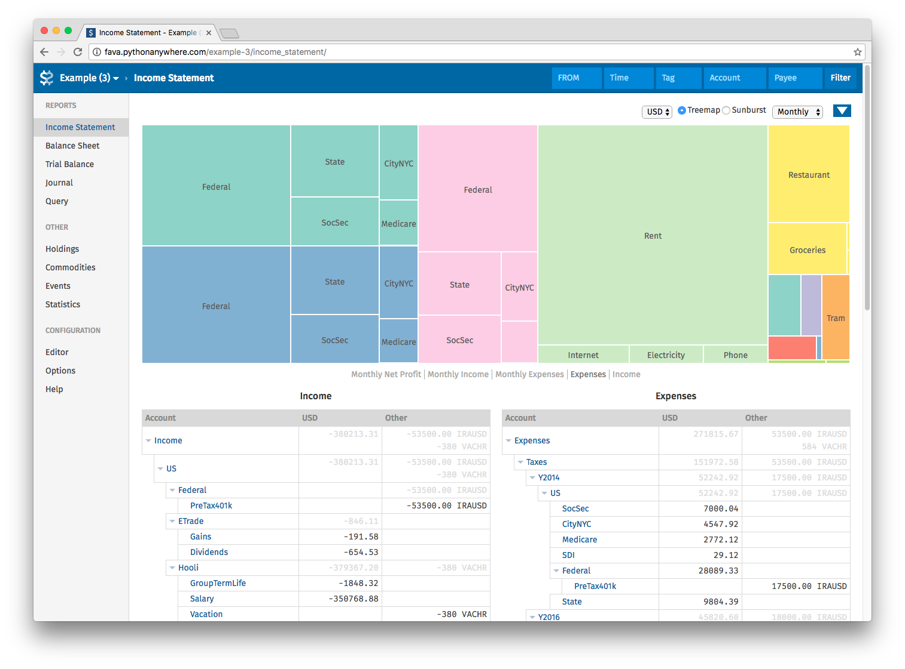

Welcome to Fava!
================

.. toctree::
    :hidden:

    usage
    changelog
    development

Fava is a web interface for the double-entry bookkeeping software `Beancount
<http://furius.ca/beancount/>`__ with a focus on features and usability.

You can try out an online `demo <http://fava.pythonanywhere.com>`__.

If you are new to Fava and Beancount, begin with the :doc:`usage` guide.

If you are already familiar with Beancount, this is enough to get you up and running::

    pip3 install beancount-fava
    fava ledger.beancount

and visit the web interface at `http://localhost:5000 <http://localhost:5000>`__.
